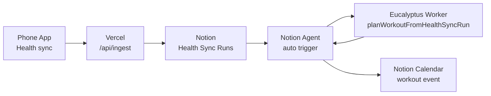

# Eucalyptus - Life Coach

<p align="center">
  
</p>

Notion Worker project for the Eucalyptus life coach. The deployed Worker is named `eucalyptus`.

## Purpose

Eucalyptus connects Notion Custom Agents, Notion Workers, Notion health planning databases, and Apple Health-shaped data. The current goal is a personal life coach that can:

- notice useful context such as Luma event emails,
- import Apple Health activity data into Notion,
- keep workout decisions auditable,
- recommend whether a workout should happen today.

## Worker Tools

- `processLumaEmailSignal`: receives likely Luma mail from a Notion Custom Agent Mail trigger.
- `importHealthFixture`: imports a local Apple Health JSON export into the health planning data sources.
- `importHealthSyncRun`: imports a mobile-uploaded Apple Health payload from a `Health Sync Runs` Notion row.
- `recommendWorkoutToday`: previews or writes a workout recommendation from health data.
- `planWorkoutFromHealthSyncRun`: imports the latest health upload and returns a calendar scheduling intent.

## Architecture



See [Architecture](docs/architecture.md) for the detailed flow.

## Requirements

- Node.js `22.18+`
- npm `10+`
- Notion CLI (`ntn`)
- A Notion integration token with access to the health data sources

Install dependencies:

```bash
npm install
```

Create `.env.local` from `.env.example` and fill in the Notion values:

```bash
cp .env.example .env.local
```

Required environment variables:

- `NOTION_API_TOKEN`
- `WORKER_NOTION_API_TOKEN` for hosted Notion Worker env, where `NOTION_*` names are reserved
- `NOTION_WORKSPACE_ID`
- `NOTION_WORKER_ID`
- `NOTION_WORKERS_CONFIG_FILE`, usually `.local/workers.json`
- `METRIC_CATALOG_DATA_SOURCE_ID`
- `DAILY_SUMMARY_DATA_SOURCE_ID`
- `WORKOUTS_DATA_SOURCE_ID`
- `WORKER_DECISIONS_DATA_SOURCE_ID`
- `HEALTH_SYNC_RUNS_DATA_SOURCE_ID`
- `NOTION_VERSION`

## Development

Run checks:

```bash
npm run typecheck
npm test
npm run build
```

Run the sample Luma tool locally:

```bash
npm run worker:exec:local
```

Deploy the Worker:

```bash
npm run worker:deploy
```

`npm run worker:deploy` generates the ignored Notion Worker config at `.local/workers.json` from `.env.local`. Do not commit the generated config; `workers.example.json` documents the expected shape.

## Health Import Usage

Dry-run a local Apple Health JSON export:

```bash
ntn workers exec importHealthFixture \
  --local \
  --dotenv .env.local \
  -d '{"path":"/absolute/path/to/apple-health.json","dryRun":true,"only":null}'
```

Import all implemented collections:

```bash
ntn workers exec importHealthFixture \
  --local \
  --dotenv .env.local \
  -d '{"path":"/absolute/path/to/apple-health.json","dryRun":false,"only":["metricCatalog","dailySummaries","workerDecisions","workouts"]}'
```

Preview today's workout recommendation:

```bash
ntn workers exec recommendWorkoutToday \
  --local \
  --dotenv .env.local \
  -d '{"path":"/absolute/path/to/apple-health.json","targetDate":null,"dryRun":true}'
```

## Mobile Upload Flow

The deployed upload endpoint accepts random-cadence Apple Health JSON uploads from the mobile app. When Notion env vars are set, it stores each upload as ordered page chunks on a `Health Sync Runs` row so the Worker can import it later.

Production URL shape:

```text
https://eucalyptus-gamma.vercel.app/api/ingest
```

For local testing, start the ingest server:

```bash
node --env-file=.env.local server.js
```

Upload JSON:

```bash
curl -X POST \
  -H 'Content-Type: application/json' \
  --data-binary @/absolute/path/to/apple-health.json \
  http://127.0.0.1:8765
```

For the Expo app, set these before starting a local build if you want the URL/token prefilled:

```bash
EXPO_PUBLIC_EUCALYPTUS_SERVER_URL=https://eucalyptus-gamma.vercel.app/api/ingest
EXPO_PUBLIC_EUCALYPTUS_INGEST_TOKEN=<same value as INGEST_TOKEN>
```

Import the latest uploaded sync run:

```bash
ntn workers exec importHealthSyncRun \
  --local \
  --dotenv .env.local \
  -d '{"pageId":null,"dryRun":false,"only":["metricCatalog","dailySummaries","workerDecisions","workouts"]}'
```

Build a calendar scheduling intent from the latest health upload:

```bash
ntn workers exec planWorkoutFromHealthSyncRun \
  --local \
  --dotenv .env.local \
  -d '{"pageId":null,"targetDate":null,"dryRun":false}'
```

If no input is provided, the tool defaults to latest health upload, latest date, and `dryRun:true`.
The tool also accepts partial input such as `{"dryRun":true}` and fills omitted fields with the same defaults.

The result tells a Notion Custom Agent whether to create a calendar event, the suggested duration/title, the reason, and the idempotency key to include in event notes.

## Notion Agent Setup

Connect the deployed `eucalyptus` Worker in Notion when adding tools to a Custom Agent. For Luma mail, the Custom Agent owns the Mail connection and calls `processLumaEmailSignal` only for likely Luma messages.

## Documentation

- [Architecture](docs/architecture.md)
- [Luma mail trigger](docs/notion-luma-mail-trigger.md)
- [Workout planner and health import](docs/plans/workout-planner/README.md)
- [Health worker data sources](docs/plans/workout-planner/health-worker-data-sources.md)
- [Native TypeScript notes](docs/native-typescript.md)

## Luma Agent Endpoints

The deployed server also exposes Luma helper endpoints:

- `GET /api/luma/research`: health/config check.
- `POST /api/luma/research`: research one attendee profile from a name and social links.
- `GET /api/luma/attendees`: health check for the attendee endpoint.
- `POST /api/luma/attendees`: returns `501` on Vercel because attendee scraping requires the local `luma-agent` browser service with a persistent logged-in Chromium profile.

Use the same bearer token as `LUMA_WEBHOOK_TOKEN`, `WEBHOOK_TOKEN`, or `INGEST_TOKEN`:

```bash
curl -X POST https://eucalyptus-gamma.vercel.app/api/luma/research \
  -H "Authorization: Bearer $LUMA_WEBHOOK_TOKEN" \
  -H "Content-Type: application/json" \
  -d '{"name":"Ada Lovelace","socials":[]}'
```

For attendee scraping, run the browser-backed local service in `luma-agent/` and call `http://127.0.0.1:8780/attendees`.
