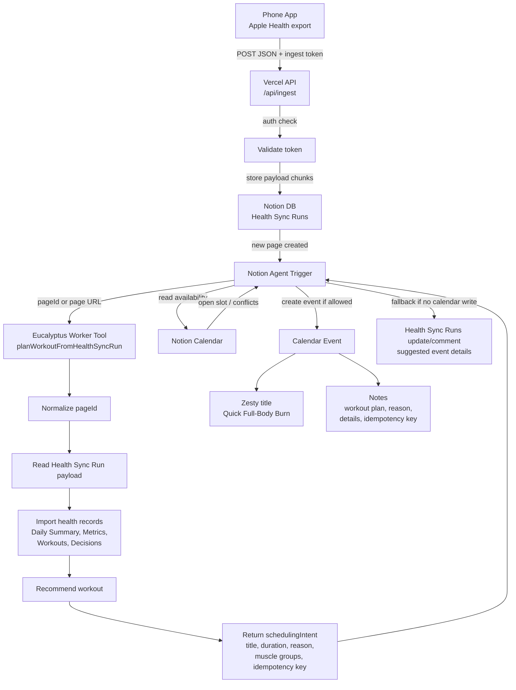

# Architecture

## Health Sync To Calendar Flow

The phone app uploads Apple Health-shaped JSON to Vercel. Vercel stores the payload in Notion as a `Health Sync Runs` row, which triggers the Notion agent. The agent calls the Eucalyptus Worker to normalize the upload, write health planning records, and return a scheduling intent. The agent then uses calendar access to create or suggest the workout event.
